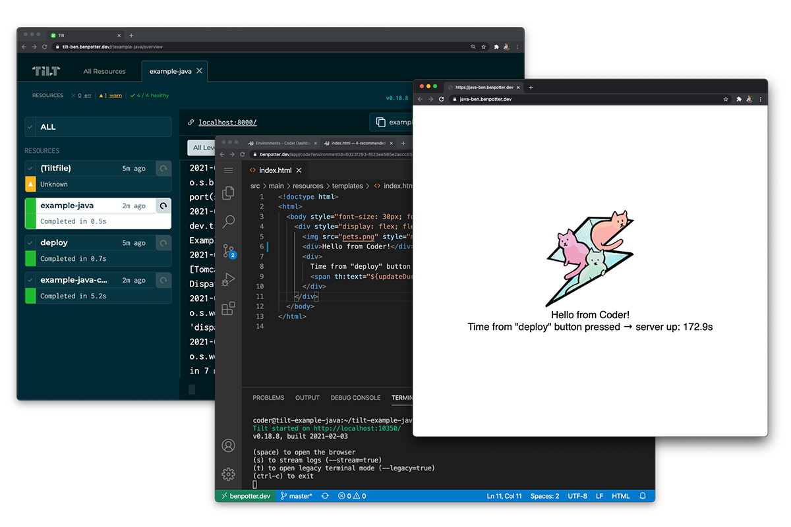
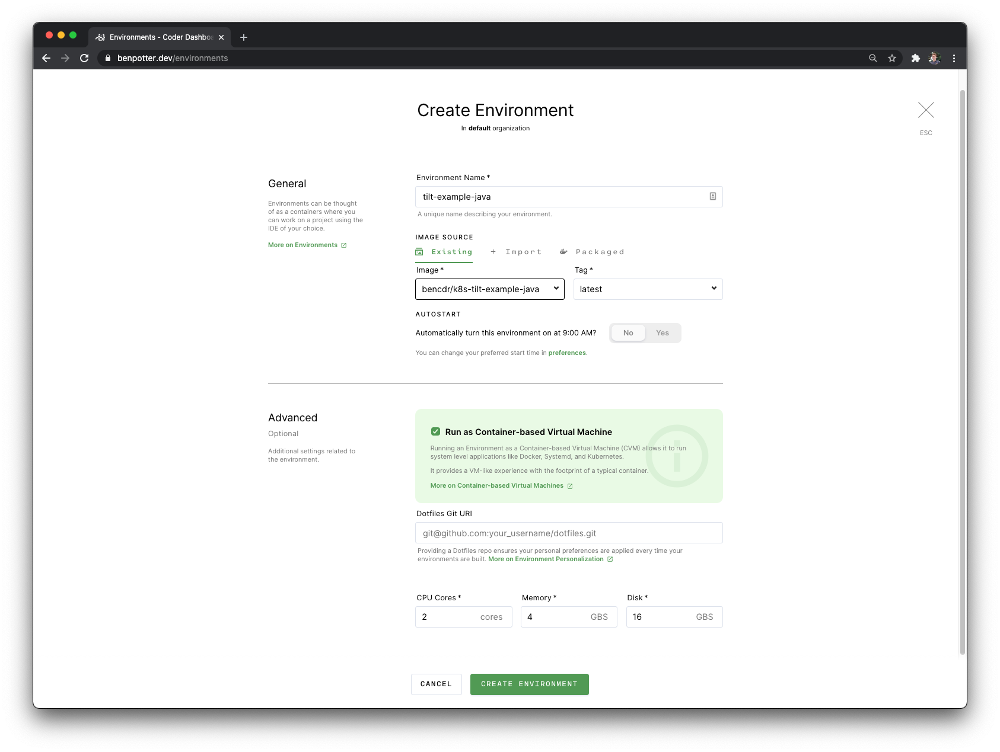
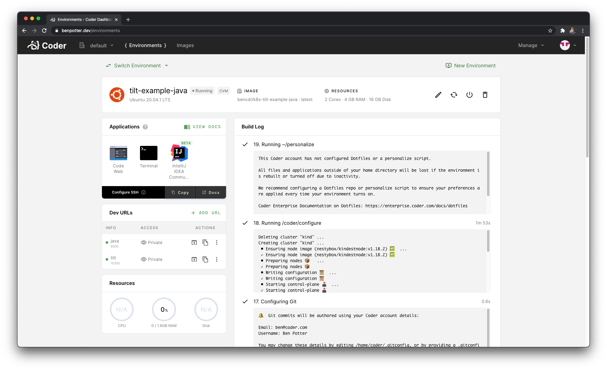

# k8s-tilt-example-java



My [k8s-tilt](../k8s-tilt) Coder image extended to support the [tilt-example-java](https://github.com/tilt-dev/tilt-example-java) project in Coder.

In Docker Hub: `bencdr/k8s-tilt-example-java:latest`

### Set up Coder workspace
- run as a CVM
- at least 4 GB RAM, 2 CPU Cores, and 16GB of disk space
- add a Dev URL on port 10350 (Tilt Ui)
- add a Dev URL on port 8000 (Java app)

### Getting started
1. Open VS Code or IntelliJ IDEA
2. Open the project folder: 
```sh
$ cd tilt-example-java/4-recommended
```
3. Start developing with Tilt:
```sh
$ tilt up
```
4. Visit your Dev URL on port 10350 to see the Tilt Ui. (Or set up SSH port tunneling to your workspace)

---




